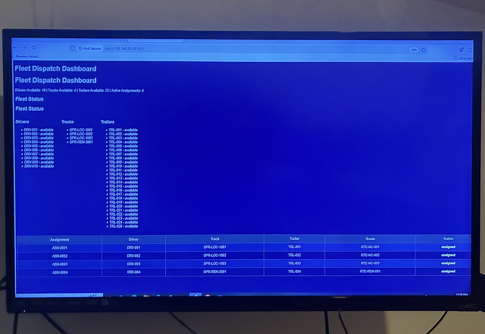
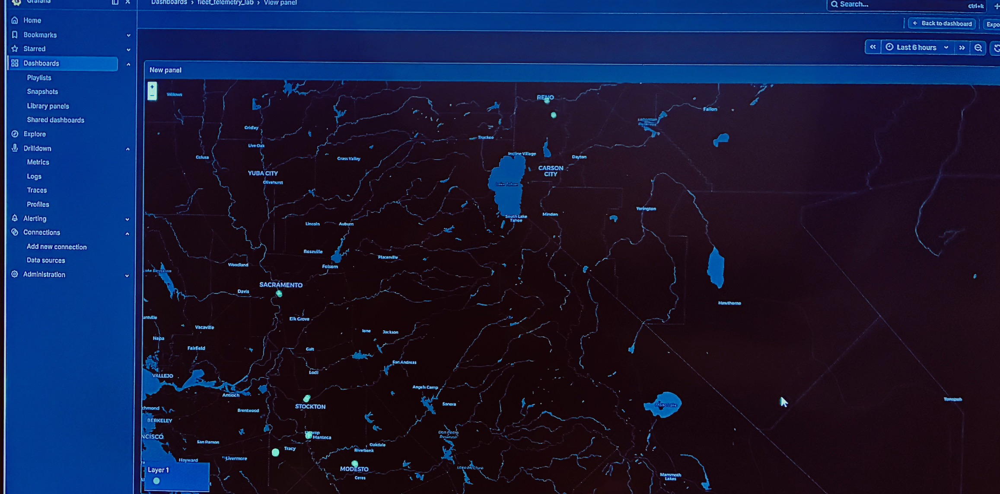
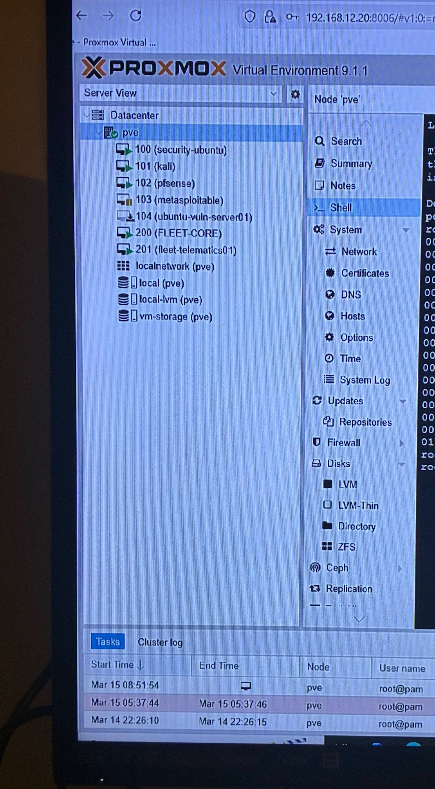

# Logistics Intelligence Lab

Fleet telemetry, dispatch monitoring, and logistics analytics platform designed to explore how modern data systems and artificial intelligence can improve transportation operations.

This project simulates components commonly found in enterprise logistics technology platforms used by large transportation networks.

---

## Project Overview

The Logistics Intelligence Lab was created to study real-world logistics challenges such as fleet visibility, dispatch coordination, and operational monitoring.

The lab integrates several technologies used in modern logistics platforms including telemetry pipelines, monitoring dashboards, and structured fleet asset modeling.

---

## Core Components

### Fleet Dispatch Dashboard
A Python Flask-based dashboard designed to simulate dispatch monitoring systems used in transportation operations.

Features include:

- Monitoring drivers, trucks, and trailers
- Tracking dispatch assignments
- Fleet availability overview
- Operational status tracking
- Real-time dashboard refresh

---

### Fleet Telemetry Pipeline

A simulated telemetry pipeline used to model how fleet monitoring systems collect and visualize operational data.

Architecture:

Telemetry Source  
→ MQTT Broker  
→ Telegraf Data Collection  
→ InfluxDB Time-Series Database  
→ Grafana Visualization

This pipeline allows telemetry data to be collected, processed, and visualized through operational dashboards.

---

### Fleet Asset Modeling

Fleet entities are modeled using structured JSON datasets including:

Drivers  
Trucks  
Trailers  
Routes  
Assignments

This allows the dispatch dashboard to simulate fleet operations and dispatch workflows.

---

## Lab Infrastructure

The environment is hosted within a virtualization lab built using **Proxmox**.

This allows experimentation with:

- telemetry pipelines
- monitoring systems
- infrastructure design
- logistics analytics platforms

---

## Technologies Used

Python  
Flask  
MQTT  
Telegraf  
InfluxDB  
Grafana  
Linux  
Proxmox

---

## Industry Context

This project is informed by real-world logistics operations experience within transportation networks utilizing supply chain visibility platforms including:

- E2open
- FourKites

---

## Research Focus

The lab explores how artificial intelligence and data systems can improve logistics decision-making through:

- fleet telemetry analysis
- dispatch monitoring systems
- transportation analytics
- operational intelligence dashboards
- AI-assisted logistics operations

---

## Purpose

The goal of the Logistics Intelligence Lab is to better understand how modern data infrastructure and AI technologies can improve fleet visibility, dispatch coordination, and transportation efficiency.

 ## System Architecture

The Logistics Intelligence Lab simulates a real-world fleet telemetry and dispatch monitoring environment.

Components include:

- **Fleet Telemetry Simulator**
  Generates synthetic GPS and vehicle data

- **Telemetry Pipeline**
  Processes incoming fleet data

- **Dispatch Dashboard**
  Displays active vehicles and operational metrics

- **Grafana Telemetry Map**
  Visualizes fleet movement geographically

- **Proxmox Lab Infrastructure**
  Hosts the virtual lab environment including security and monitoring systems

  Detailed documentation of the infrastructure environment can be found here:

[Lab Environment Documentation](docs/lab-environment.md)

  ## Technology Stack

This lab environment uses several technologies to simulate a real-world logistics analytics platform:

- **Python** – telemetry simulation and backend logic
- **Grafana** – fleet visualization dashboards
- **Proxmox VE** – virtualization infrastructure
- **Linux** – system environment for services and security labs
- **Networking tools** – pfSense firewall and virtual network

- For a detailed technical architecture breakdown see:

[System Architecture Documentation](docs/system-architecture.md)

## System Screenshots

### Dispatch Dashboard

### Fleet Telemetry Map

### Lab Infrastructure

