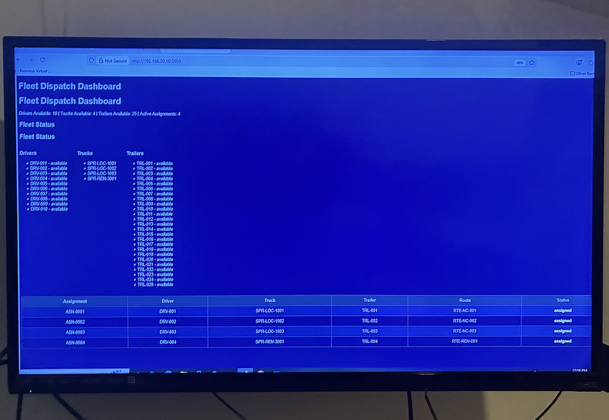
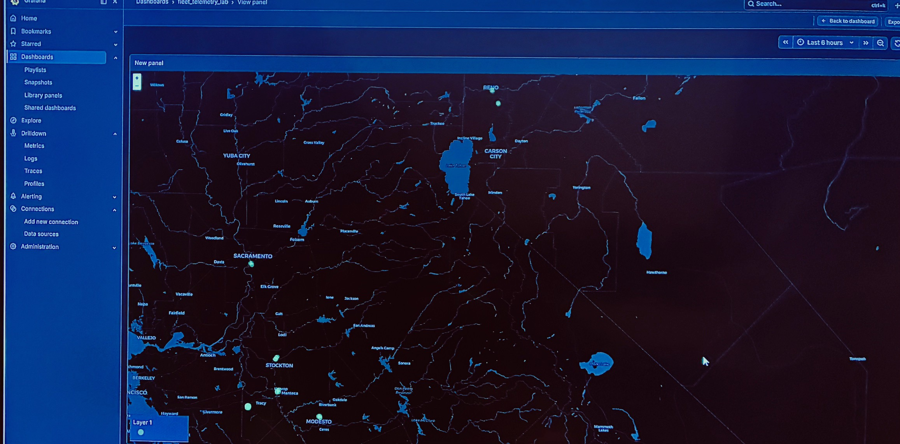
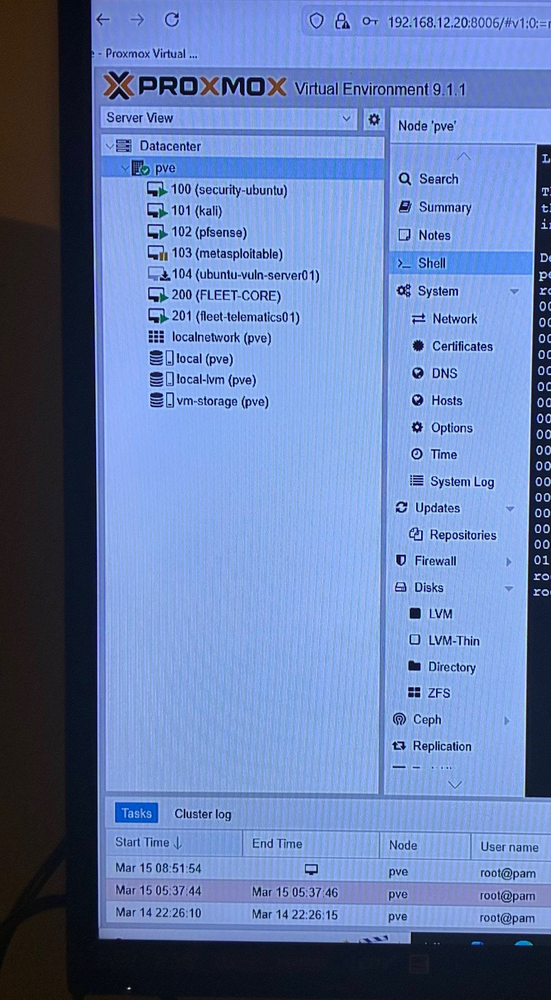

# Logistics Intelligence Lab

A foundational hands-on transportation technology laboratory focused on fleet telemetry, dispatch visibility, observability, virtualization, fleet-data modeling, and logistics analytics.

> **Status:** This repository represents an earlier laboratory and synthetic environment used to study transportation technology architecture. It is preserved as part of the progression from freight operations into later logistics systems and product work. It is **not** presented as current production architecture.

## Why This Repository Exists

The Logistics Intelligence Lab was created to explore how modern data infrastructure can support real transportation problems such as fleet visibility, dispatch coordination, operational monitoring, telemetry ingestion, and transportation analytics.

The project intentionally uses synthetic and simulated components where appropriate. Its value is in the systems thinking, infrastructure integration, and operational modeling demonstrated by the environment—not in pretending laboratory data is production freight data.

## What the Lab Demonstrates

- Fleet telemetry generation and ingestion
- Dispatch-oriented operational dashboards
- MQTT-based telemetry flow
- Telegraf and InfluxDB observability pipelines
- Grafana fleet visualization
- Python/Flask application development
- Fleet asset modeling using structured data
- Linux service operation and troubleshooting
- Proxmox virtualization and virtual networking
- pfSense-backed lab networking and infrastructure monitoring
- Early AI-assisted route-risk and transportation analytics experiments

## System Architecture

The lab models a fleet telemetry and dispatch-monitoring environment with several connected components:

- **Fleet Telemetry Simulator** — generates synthetic GPS and vehicle observations for controlled testing
- **Telemetry Pipeline** — transports and stores fleet observations for monitoring and analysis
- **Dispatch Dashboard** — presents active vehicles and operational metrics through a Flask-based interface
- **Grafana Telemetry Map** — visualizes fleet movement geographically
- **Fleet Asset Models** — represent transportation assets and operating data in structured form
- **Proxmox Lab Infrastructure** — hosts the virtualized environment, networking, monitoring, and supporting services

For additional detail, see:

- [System Architecture](docs/system-architecture.md)
- [Lab Environment](docs/lab-environment.md)
- [Real World Logistics Problems](docs/real-world-logistics-problems.md)

## Technology Stack

**Application & Data**  
Python • Flask • JSON • MQTT • Telegraf • InfluxDB • Grafana

**Infrastructure**  
Linux • Proxmox VE • pfSense • virtual networking • infrastructure monitoring

**Transportation Focus**  
Fleet telemetry • dispatch visibility • asset modeling • transportation analytics • operational monitoring

## Project Structure

| Directory | Purpose |
| --- | --- |
| `ai-tools` | Early AI and route-risk experiments |
| `dispatch-dashboard` | Flask-based fleet dispatch monitoring UI |
| `telemetry-pipeline` | Telemetry ingestion architecture and documentation |
| `fleet-data` | Fleet asset data models |
| `supply-chain-model` | Logistics network modeling concepts |
| `docs` | System architecture and infrastructure documentation |
| `screenshots` | Visual examples of dashboards and infrastructure |

## System Screenshots

### Dispatch Dashboard

### Fleet Telemetry Map

### Lab Infrastructure

## Evolution of the Work

This lab predates later private logistics technology and product-development work. It helped establish practical experience with telemetry pipelines, dispatch-oriented interfaces, observability, infrastructure, fleet-data modeling, and the operational limitations that appear when transportation systems disagree or data moves across multiple boundaries.

The public repository remains intentionally bounded to its original laboratory purpose. Newer private systems should not be inferred to exist in this codebase, and proprietary implementation details are not published here.

## Documentation

Additional project documentation:

- [System Architecture](docs/system-architecture.md)
- [Lab Environment](docs/lab-environment.md)
- [Real World Logistics Problems](docs/real-world-logistics-problems.md)
